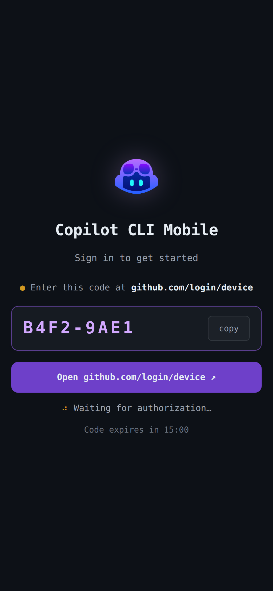
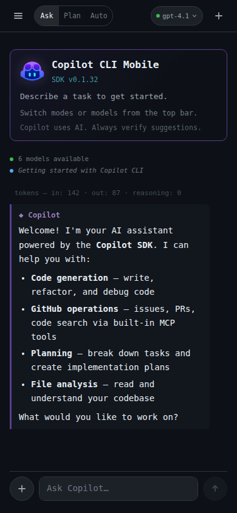

# Copilot CLI Mobile

> **GitHub Copilot CLI — from your phone.** Self-hosted, real-time, powered by the official [Copilot SDK](https://github.com/github/copilot-sdk).

<p align="center">
  
  
  
  
</p>

The same Copilot CLI you use in your terminal — accessible from any browser. Authenticate with GitHub, pick a model, chat. Full parity with the desktop CLI: built-in tools for the GitHub API, file access, and shell.

> **Disclaimer:** This is an independent, community-driven project — not an official GitHub product. Use at your own risk.

---

## Screenshots

<p align="center">
  
  &nbsp;&nbsp;
  
</p>

---

- **Real-time streaming** — token-by-token over WebSocket
- **All Copilot models** — GPT-4.1, o-series, Claude, Gemini — switch mid-conversation
- **Extended thinking** — live reasoning traces for supported models
- **Modes** — ask / plan / autopilot, just like the CLI
- **GitHub MCP tools** — issues, PRs, code search, repos — all built in
- **Custom instructions** — appended to the system prompt, SDK guardrails preserved
- **Mobile-first dark UI** — responsive, touch-optimized, keyboard-aware
- **2 env vars to run** — `GITHUB_CLIENT_ID` + `SESSION_SECRET`

---

## Quick Start

### Prerequisites

- **GitHub account** with a [Copilot license](https://github.com/features/copilot#pricing) (free tier works)
- **GitHub OAuth App** — [register one](https://github.com/settings/developers) in 30 seconds:

  1. Click **New OAuth App** → name it anything, set both URLs to `http://localhost:3000`
  2. Copy the **Client ID** — that's your `GITHUB_CLIENT_ID`

  > Device Flow auth — no client secret needed, no redirect URI to configure.

### GitHub Codespaces (fastest)

1. Add `GITHUB_CLIENT_ID` as a [Codespace secret](https://github.com/settings/codespaces) scoped to this repo
2. Launch:

   [](https://codespaces.new/devartifex/copilot-cli-mobile?quickstart=1)

3. Done — the app builds and opens automatically.

### Docker

```bash
# Create .env
echo "GITHUB_CLIENT_ID=<your-client-id>" >> .env
echo "SESSION_SECRET=$(openssl rand -hex 32)" >> .env

docker compose up --build
```

Open [localhost:3000](http://localhost:3000) — enter the code on GitHub, start chatting.

### Node.js

Requires Node.js 24+ (the SDK needs `node:sqlite`).

```bash
npm install && npm run build && npm start
```

---

## Configuration

| Variable | Required | Default | Description |
|----------|:--------:|---------|-------------|
| `GITHUB_CLIENT_ID` | Yes | — | GitHub OAuth App client ID |
| `SESSION_SECRET` | Yes | — | Session encryption key (`openssl rand -hex 32`) |
| `PORT` | — | `3000` | HTTP server port |
| `BASE_URL` | — | `http://localhost:3000` | App URL for cookies + WebSocket origin validation |
| `NODE_ENV` | — | `development` | `production` enables secure cookies + trust proxy |
| `ALLOWED_GITHUB_USERS` | — | — | Comma-separated allowlist of GitHub usernames |
| `TOKEN_MAX_AGE_MS` | — | `86400000` | Force re-auth interval in ms (default: 24h) |

---

## How It Works

```
Browser ──WebSocket──▶ Express Server ──JSON-RPC──▶ @github/copilot CLI subprocess
   │                       │                              │
   │  Device Flow auth     │  Session per connection      │  Copilot API
   │  Streaming render     │  SDK event forwarding        │  GitHub MCP tools
   ▼                       ▼                              ▼
```

1. User opens the app → authenticates via GitHub Device Flow
2. Token stored server-side in Express session (never sent to browser)
3. WebSocket connection opens → server spawns a `CopilotClient` with its own CLI subprocess
4. User sends a message → SDK streams events → server forwards them as typed JSON → browser renders in real time
5. On disconnect → session destroyed, CLI subprocess terminated

<details>
<summary><strong>SDK features implemented</strong></summary>

| Feature | SDK API | UI |
|---------|---------|-----|
| Model selection | `SessionConfig.model` + `client.listModels()` | Dropdown in status bar, mid-session switching |
| Reasoning effort | `SessionConfig.reasoningEffort` | Toggle group (low / medium / high / xhigh) |
| Streaming | `assistant.message_delta` events | Token-by-token with typing cursor |
| Extended thinking | `assistant.reasoning_delta` / `reasoning` | Collapsible live reasoning block |
| Modes | `session.rpc.mode.set()` | Three-button toggle (ask / plan / auto) |
| Custom instructions | `SessionConfig.systemMessage` (append) | Settings panel textarea |
| GitHub MCP | `SessionConfig.mcpServers` | All GitHub tools, user's token |
| Tool lifecycle | `tool.execution_start/progress/complete` | Spinner + checkmark |
| User input | `onUserInputRequest` callback | Choice buttons + freeform input |
| Subagents | `subagent.started/completed` | Agent display with status |
| Token usage | `assistant.usage` | Token counts after each response |
| Abort | `session.abort()` | Stop button during streaming |

</details>

<details>
<summary><strong>WebSocket message protocol</strong></summary>

**Client → Server:**

| Type | Purpose |
|------|---------|
| `new_session` | Create session with model, reasoning, instructions, excluded tools |
| `message` | Send user prompt (max 10,000 chars) |
| `list_models` | Fetch available models |
| `set_mode` | Switch: `interactive` / `plan` / `autopilot` |
| `set_model` | Change model mid-session |
| `set_reasoning` | Update reasoning effort |
| `abort` | Cancel streaming response |
| `user_input_response` | Reply to SDK prompt |
| `list_tools` / `list_agents` | Discover available tools and agents |
| `select_agent` / `deselect_agent` | Manage active agents |
| `get_quota` / `compact` | Usage info and context compaction |
| `list_sessions` / `resume_session` | Session history |
| `get_plan` / `update_plan` / `delete_plan` | Plan management |

**Server → Client:**

| Type | Source | Purpose |
|------|--------|---------|
| `connected` | — | Connection ready, includes GitHub username |
| `session_created` | — | Session initialized |
| `delta` | `assistant.message_delta` | Streamed token |
| `reasoning_delta` / `reasoning_done` | `assistant.reasoning_*` | Thinking traces |
| `intent` | `assistant.intent` | Model's inferred intent |
| `turn_start` / `turn_end` | `assistant.turn_*` | Turn lifecycle |
| `tool_start` / `tool_progress` / `tool_end` | `tool.execution_*` | Tool lifecycle |
| `mode_changed` / `model_changed` | — | Setting confirmations |
| `title_changed` | `session.title_changed` | Auto-generated title |
| `usage` | `assistant.usage` | Token counts |
| `warning` / `error` | `session.*` | Session alerts |
| `subagent_start` / `subagent_end` / `subagent_failed` | `subagent.*` | Agent lifecycle |
| `info` / `plan_changed` / `skill_invoked` | `session.*` | Informational |
| `user_input_request` | `onUserInputRequest` | SDK asks for input |
| `elicitation_requested` / `elicitation_completed` | `elicitation.*` | Structured prompts |
| `compaction_start` / `compaction_complete` | `session.compaction_*` | Context management |
| `models` | `client.listModels()` | Model list |
| `done` / `aborted` | — | Response lifecycle |

</details>

<details>
<summary><strong>Security</strong></summary>

- **Server-side tokens** — GitHub token in Express session, never sent to browser
- **Helmet** — CSP, HSTS, X-Frame-Options, X-Content-Type-Options
- **Rate limiting** — 200 req / 15 min per IP
- **Secure cookies** — httpOnly, secure (prod), sameSite: lax, 30-day rolling
- **Session fixation** — `session.regenerate()` after auth
- **Token freshness** — configurable expiry + GitHub API revalidation on WebSocket connect
- **Origin validation** — WebSocket origin checked against `BASE_URL` in production
- **User allowlist** — optional `ALLOWED_GITHUB_USERS`
- **Input limits** — 10,000 char messages, 2,000 char instructions (server-enforced)
- **XSS prevention** — DOMPurify + SRI hashes on CDN scripts
- **System prompt safety** — append mode only, SDK guardrails preserved

</details>

<details>
<summary><strong>Project structure</strong></summary>

```
src/
├── index.ts              # HTTP server + WebSocket setup
├── config.ts             # Env var validation (fail-fast)
├── server.ts             # Express app + middleware
├── security-log.ts       # Structured security logging
├── auth/
│   ├── github.ts         # Device Flow OAuth
│   └── middleware.ts     # Session guard + token freshness
├── copilot/
│   ├── client.ts         # CopilotClient factory
│   └── session.ts        # SessionConfig builder
├── routes/
│   ├── auth.ts           # /auth/* endpoints
│   └── api.ts            # /api/* endpoints (guarded)
├── ws/
│   └── handler.ts        # WebSocket message routing + SDK events
└── types/
    └── session.d.ts      # Session type augmentation

public/
├── index.html            # SPA shell (login + chat)
├── css/style.css         # Dark theme, mobile-first
└── js/
    ├── app.js            # Init + auth orchestration
    ├── auth.js           # Device flow client
    └── chat.js           # WebSocket + markdown rendering
```

</details>

---

## Authentication & Authorization

This section documents the OAuth model, token scopes, and runtime authorization to help teams evaluate the app for security and governance.

### OAuth App type

This app uses a **GitHub OAuth App** (not a GitHub App). It authenticates via the [Device Flow](https://docs.github.com/en/apps/oauth-apps/building-oauth-apps/authorizing-oauth-apps#device-flow) — the same flow used by the GitHub CLI. No client secret is needed; only the **Client ID** is required.

### Token scopes

The app requests the following OAuth scopes when the user authenticates:

| Scope | Why it's needed | What it grants |
|-------|-----------------|----------------|
| `copilot` | Required by the Copilot SDK to call the Copilot API | Access to Copilot chat completions and model listing |
| `read:user` | Display the user's name and avatar in the UI | **Read-only** access to the user's GitHub profile |
| `repo` | Required by the SDK's built-in tools (file access, shell commands, code search) | **Read and write** access to all repositories the user can access |

> [!IMPORTANT]
> The `repo` scope is broad — it grants read/write access to the user's repositories. This is required because the Copilot SDK's built-in tools (file operations, shell, code search) need repository access to function. This matches the permissions of the desktop Copilot CLI. If your governance policy restricts this scope, consider using `ALLOWED_GITHUB_USERS` to limit who can authenticate, or use `excludedTools` in the session config to disable tools that require repo access.

### How the token is used

| Usage | Detail |
|-------|--------|
| **Copilot API** | Passed to `CopilotClient` to authenticate against the Copilot API for chat completions and model listing |
| **GitHub MCP tools** | Passed as a Bearer token to the GitHub MCP server (`/mcp/x/all/readonly`) for built-in tools (issues, PRs, code search) |
| **Identity validation** | Used to call `GET /user` on the GitHub API to verify the user's identity and check token validity |

### Token lifecycle

1. **Acquisition** — User authenticates via Device Flow; token is returned by GitHub's OAuth endpoint
2. **Storage** — Token is stored **server-side only** in the Express session (encrypted via `SESSION_SECRET`). It is **never sent to the browser**.
3. **Freshness** — Token age is checked on every API request against `TOKEN_MAX_AGE_MS`. On WebSocket connect, the token is also validated against `GET /user` to catch revoked tokens.
4. **Revocation** — When the user logs out or the session expires, the token is destroyed server-side. Users can also revoke the token from [GitHub Settings → Applications](https://github.com/settings/applications).

### Access control

| Control | Description |
|---------|-------------|
| **User allowlist** | Set `ALLOWED_GITHUB_USERS` (comma-separated) to restrict login to specific GitHub accounts |
| **Copilot license** | A GitHub Copilot license (free, pro, or enterprise) is required — users without one cannot use the Copilot API |
| **Session expiry** | Sessions expire after `TOKEN_MAX_AGE_MS` (default: 24h), forcing re-authentication |
| **Rate limiting** | 200 requests per 15 minutes per IP address |
| **IP restrictions** | When deployed to Azure, IP allowlists can be configured via the `ipRestrictions` Bicep parameter |

### What this app does NOT do

- **No client secret** — Device Flow does not require or use a client secret
- **No server-side repo operations** — The server itself never reads or writes repositories; repo access is used only by the Copilot SDK's built-in tools running within the user's own session
- **No token sharing** — Each user's token is isolated in their own server-side session
- **No long-term storage** — Tokens are held only in-memory (or file-based sessions in dev); nothing is persisted to a database

---

## Deploy to Azure

<details>
<summary><strong>Azure Container Apps with <code>azd up</code></strong></summary>

```bash
az login && azd auth login
azd env set GITHUB_CLIENT_ID <your-client-id>

# Optional
azd env set allowedGithubUsers "user1,user2"
azd env set ipRestrictions "203.0.113.0/24"

azd up
```

Provisions: Container Registry, Container App (auto-TLS, CORS), Managed Identity, Log Analytics + App Insights. `SESSION_SECRET` auto-generated, all secrets encrypted at rest.

```bash
azd deploy    # Subsequent deploys (skip infra provisioning)
```

</details>

<details>
<summary><strong>CI/CD with GitHub Actions</strong></summary>

Create a service principal:

```bash
az ad sp create-for-rbac \
  --name "copilot-cli-mobile-cicd" \
  --role contributor \
  --scopes /subscriptions/<sub-id>/resourceGroups/<rg> \
  --sdk-auth
```

Add to **GitHub → Settings → Secrets → Actions**:

| Secret | Value |
|--------|-------|
| `AZURE_CREDENTIALS` | JSON output from above |
| `ACR_LOGIN_SERVER` | `<registry>.azurecr.io` |
| `ACR_NAME` | Registry name |
| `AZURE_RESOURCE_GROUP` | Resource group name |

- `ci.yml` — lint + build on every push
- `deploy.yml` — Docker build → ACR → Container Apps on push to `main`

</details>

## License

MIT
